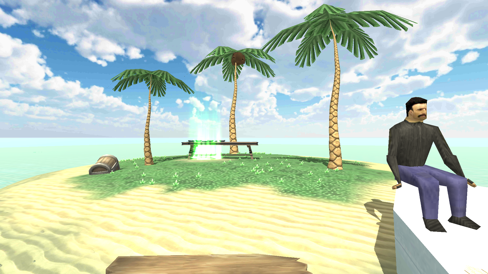
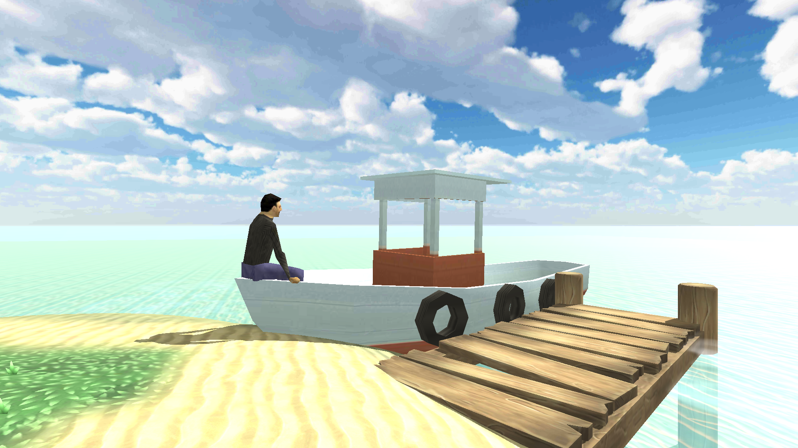
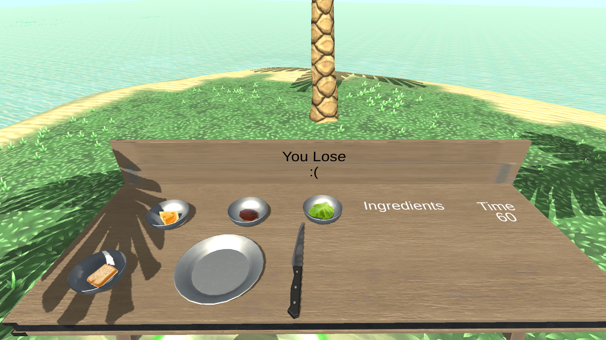

# SandwichContest Mixed Reality
Mixed Reality project aiming to create the movement in VR environment 
just by moving in real life without SteamVR bases or full body tracking 

APP Work Flow
---------------
* Enter a virtual island with water and sunny enviroment  
* Move (in real life) to the contest start point
* The contest will start and you have to make sandwitches.
* You must finish the sandwitchs before contest time end
* Win for an amazing surprise

Concepts Used
---------------
* C# Object-oriented programming.
* Virtual Reallity (Samsung Gear VR).
* Augment Reallity (ARCore).
* ARCore Plane Detection.
* Oculus Mobile SDK Modifations.
* ARCore Source Code Modifations.
* Lighting.
* Shaders.
* Materials.
* Particle Systems.
* Unity Animations.

Known Problems
--------------

- Gear VR Controllers doesn't allow the player to play the contest duo to it's movement range
(Controllers Source Code and hardware need a lot of modifactions to fix the problem)

- Slow Movement 
(Because ARCore plane detection is so slow - preformance can be increased by walking in a colorful open area with a good lighting)

Pre-requisites
--------------

- Samsung Gear VR
- ARCore Supported Device
- Open area with good lighting

Screenshots
-------------

       
Getting Started
---------------

Build APP on prefered platform using Unity.

Contacts
-------

- Linkedin: https://www.linkedin.com/in/engmohamedosama/
- FaceBook: https://www.facebook.com/EngineerMohamedOsama
- Email: EngMohamedOsama@yandex.com

If you've found an error in this sample, please file an issue to email.

License
-------

Copyrights 2019 All Right Reserved To Eng.MohamedOsama.
